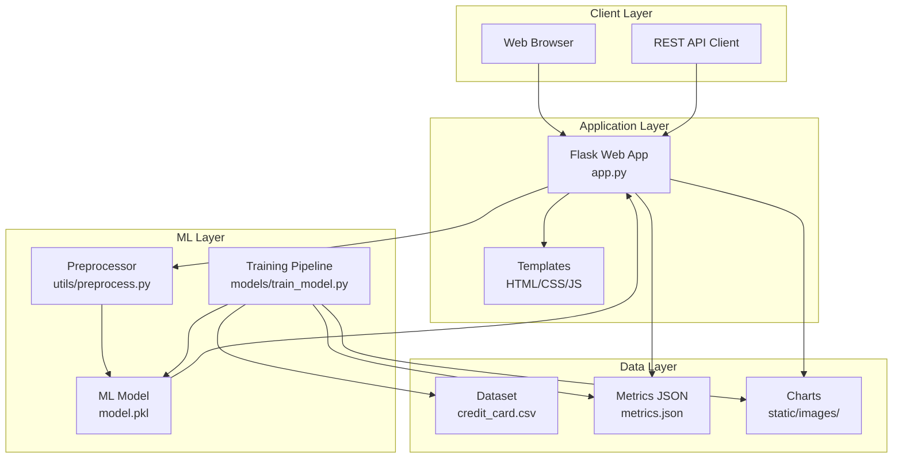
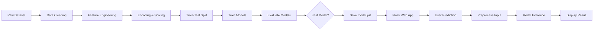
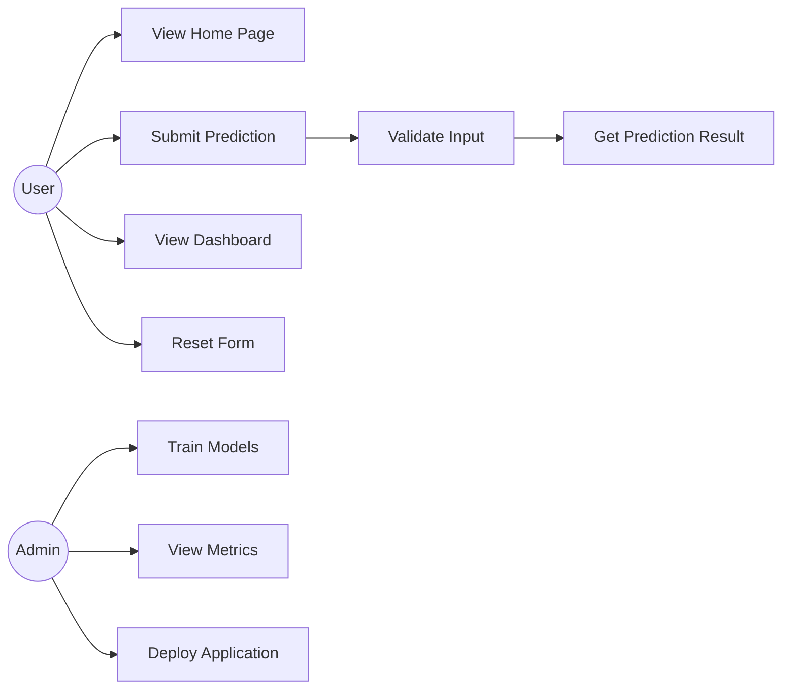
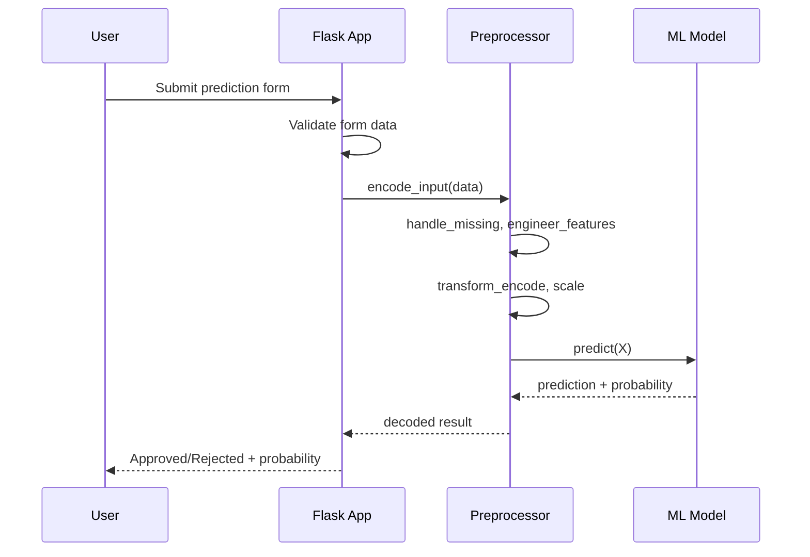
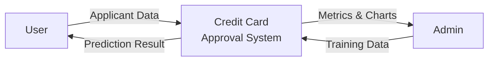
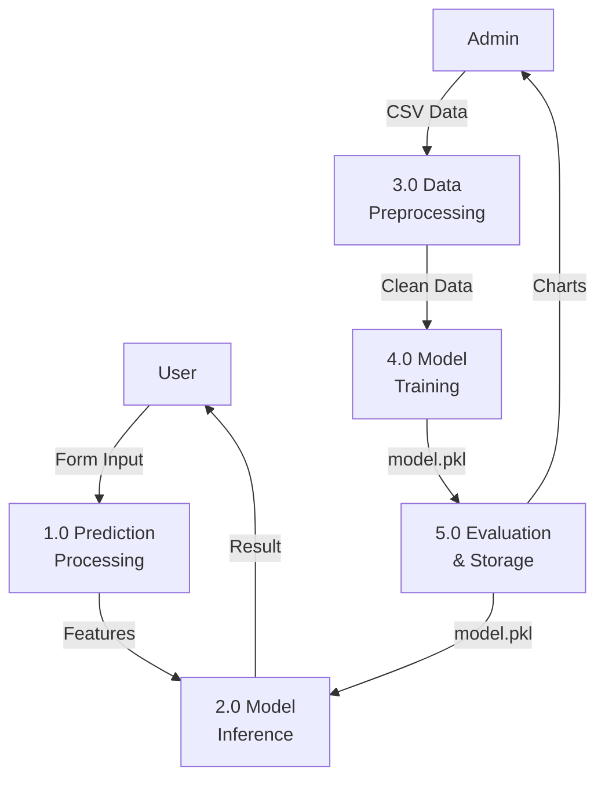
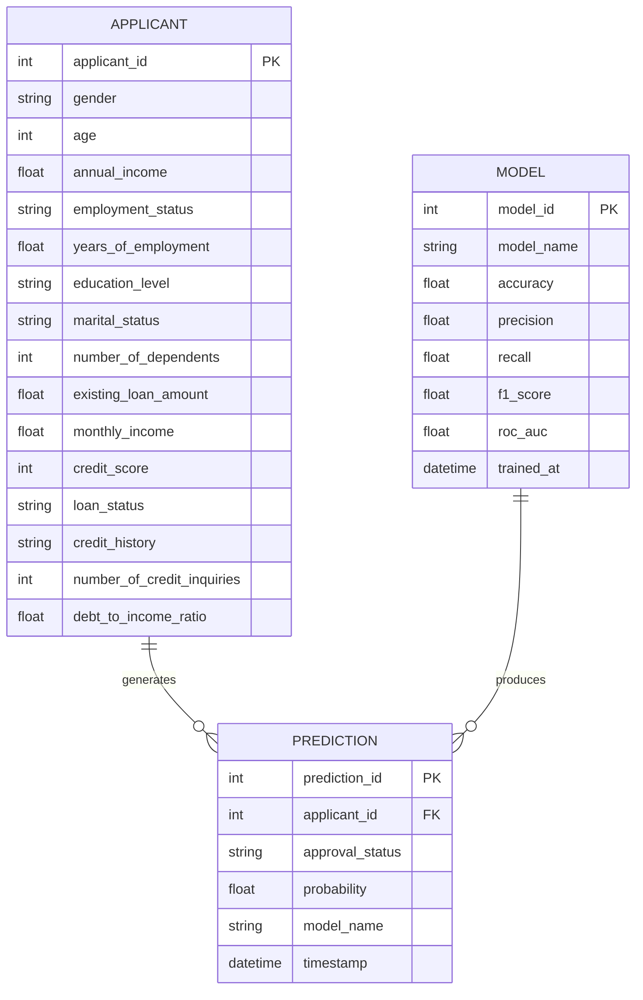

# Credit Card Approval Prediction using Machine Learning

An end-to-end Machine Learning project that predicts whether a credit card application will be **Approved** or **Rejected** based on applicant financial and demographic information.


## Screenshots

| Home Page | Prediction Page | Dashboard |
|-----------|-----------------|-----------|
|  |  |  |

> **Note:** Run the app and capture screenshots to replace placeholders in `screenshots/`.

---

## Table of Contents

- [Project Overview](#project-overview)
- [Features](#features)
- [Tech Stack](#tech-stack)
- [Project Structure](#project-structure)
- [Installation](#installation)
- [Usage](#usage)
- [Model Training](#model-training)
- [API Endpoints](#api-endpoints)
- [Model Comparison](#model-comparison)
- [System Diagrams](#system-diagrams)
- [Deployment](#deployment)
- [License](#license)

---

## Project Overview

This project implements a complete ML pipeline:

1. **Data Preprocessing** — duplicates, missing values, encoding, scaling, outliers, feature engineering
2. **Model Training** — Logistic Regression, Decision Tree, Random Forest, XGBoost
3. **Evaluation** — Accuracy, Precision, Recall, F1, ROC-AUC, Confusion Matrix
4. **Web Application** — Flask app with prediction form and analytics dashboard

---

## Features

- 15 input features matching real credit application forms
- Automatic best model selection (F1 score)
- Pickle model persistence for production deployment
- Responsive Bootstrap 5 UI
- JavaScript form validation
- REST API for programmatic predictions
- Interactive analytics dashboard with charts

---

## Tech Stack

| Layer | Technology |
|-------|------------|
| Language | Python 3.10+ |
| ML | scikit-learn, XGBoost |
| Web Framework | Flask |
| Frontend | Bootstrap 5, HTML, CSS, JavaScript |
| Visualization | Matplotlib, Seaborn |
| Deployment | Gunicorn, Render, Railway |

---

## Project Structure

```
CreditCardApproval/
├── app.py                  # Flask web application
├── requirements.txt        # Python dependencies
├── README.md               # Project documentation
├── model.pkl               # Trained model artifact
├── dataset/
│   └── credit_card.csv     # Credit card approval dataset
├── notebooks/
│   └── model_training.ipynb
├── templates/
│   ├── base.html
│   ├── index.html
│   ├── predict.html
│   └── dashboard.html
├── static/
│   ├── css/style.css
│   ├── js/validation.js
│   └── images/             # Evaluation charts
├── models/
│   └── train_model.py      # Training pipeline script
├── utils/
│   ├── preprocess.py       # Data preprocessing
│   └── helper.py           # Evaluation & visualization
└── screenshots/            # App screenshots
```

---

## Installation

```bash
# Clone or navigate to project
cd CreditCardApproval

# Create virtual environment (recommended)
python -m venv venv
source venv/bin/activate        # Linux/Mac
venv\Scripts\activate           # Windows

# Install dependencies
pip install -r requirements.txt
```

---

## Usage

### 1. Train the Model

```bash
python models/train_model.py
```

This generates `model.pkl`, `dataset/credit_card.csv`, and charts in `static/images/`.

### 2. Run the Web App

```bash
python app.py
```

Open **http://localhost:5000** in your browser.

### 3. Production Server

```bash
gunicorn app:app --bind 0.0.0.0:5000
```

---

## Model Training

The training script (`models/train_model.py`) performs:

| Step | Description |
|------|-------------|
| Data Loading | Load or generate 1,500+ sample records |
| Duplicate Removal | Remove duplicate rows |
| Missing Values | Median (numeric), mode (categorical) |
| Outlier Treatment | IQR capping method |
| Feature Engineering | Income consistency, loan ratios, credit risk |
| Encoding | Label encoding for categorical features |
| Scaling | StandardScaler for numeric features |
| Train-Test Split | 80/20 stratified split |
| Model Training | 4 classifiers trained and compared |
| Evaluation | Full metrics + visualization charts |
| Model Save | Best model saved to `model.pkl` |

---

## API Endpoints

| Endpoint | Method | Description |
|----------|--------|-------------|
| `/` | GET | Home page |
| `/predict` | GET/POST | Prediction form |
| `/dashboard` | GET | Analytics dashboard |
| `/api/metrics` | GET | JSON model metrics |
| `/api/predict` | POST | REST prediction API |

### Example API Request

```bash
curl -X POST http://localhost:5000/api/predict \
  -H "Content-Type: application/json" \
  -d '{
    "gender": "Male",
    "age": 35,
    "annual_income": 75000,
    "employment_status": "Employed",
    "years_of_employment": 8,
    "education_level": "Bachelor",
    "marital_status": "Married",
    "number_of_dependents": 2,
    "existing_loan_amount": 10000,
    "monthly_income": 6000,
    "credit_score": 720,
    "loan_status": "None",
    "credit_history": "Good",
    "number_of_credit_inquiries": 1,
    "debt_to_income_ratio": 0.25
  }'
```

---

## Model Comparison

| Model | Accuracy | Precision | Recall | F1 Score | ROC-AUC |
|-------|----------|-----------|--------|----------|---------|
| Logistic Regression | 0.79 | 0.78 | 0.31 | 0.44 | 0.70 |
| Decision Tree | 0.71 | 0.44 | 0.31 | 0.36 | 0.63 |
| Random Forest | 0.79 | 0.84 | 0.26 | 0.40 | 0.75 |
| **XGBoost** | **0.79** | **0.77** | **0.33** | **0.47** | **0.76** |

> Best model selected automatically based on **F1 Score** (balances precision and recall).

---

## System Diagrams

### System Architecture Diagram



### Workflow Diagram



### Use Case Diagram



### Sequence Diagram



### Data Flow Diagram - Level 0



### Data Flow Diagram - Level 1



### ER Diagram



---

## Deployment

### IBM Watson Machine Learning

1. Create an IBM Cloud account and Watson Machine Learning service
2. Upload `model.pkl` to Watson Model Registry
3. Create a deployment endpoint
4. Update Flask app to call Watson API or deploy Flask on IBM Cloud Code Engine:

```bash
# Install IBM CLI and login
ibmcloud login
ibmcloud ce project create --name credit-card-ml
ibmcloud ce app create --name credit-card-app \
  --image python:3.11 \
  --build-source . \
  --cmd "gunicorn app:app --bind 0.0.0.0:8080"
```

### Streamlit Community Cloud

Create `streamlit_app.py` as an alternative UI:

```python
import pickle
import streamlit as st
from utils.preprocess import DataPreprocessor

artifact = pickle.load(open("model.pkl", "rb"))
model = artifact["model"]
preprocessor = artifact["preprocessor"]

st.title("Credit Card Approval Prediction")
gender = st.selectbox("Gender", ["Male", "Female"])
age = st.number_input("Age", 18, 100, 30)
# ... add other fields
if st.button("Predict"):
    data = {"gender": gender, "age": age, ...}
    X = preprocessor.transform(preprocessor.encode_input(data))
    result = preprocessor.decode_target(model.predict(X)[0])
    st.success(f"Result: {result}")
```

Deploy via [share.streamlit.io](https://share.streamlit.io) by connecting your GitHub repo.

### Render

1. Push project to GitHub
2. Create new **Web Service** on [render.com](https://render.com)
3. Set build command: `pip install -r requirements.txt && python models/train_model.py`
4. Set start command: `gunicorn app:app --bind 0.0.0.0:$PORT`
5. Deploy

Create `render.yaml`:

```yaml
services:
  - type: web
    name: credit-card-approval
    env: python
    buildCommand: pip install -r requirements.txt && python models/train_model.py
    startCommand: gunicorn app:app --bind 0.0.0.0:$PORT
```

### Railway

1. Push project to GitHub
2. Create new project on [railway.app](https://railway.app)
3. Connect GitHub repository
4. Railway auto-detects Python; set start command:

```
gunicorn app:app --bind 0.0.0.0:$PORT
```

5. Add environment variable `PORT` if needed
6. Deploy

Create `Procfile`:

```
web: gunicorn app:app --bind 0.0.0.0:$PORT
```

---

## License

This project is open source and available under the MIT License.

---

## Author

Built as an end-to-end Machine Learning portfolio project demonstrating data science and full-stack Python development best practices.
